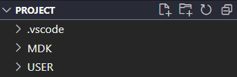

# STC 32 Project
A open source project about embedding stuffs.

## VS Code Environment

A simple guide to use VS Code as a Text Editor (support compile) for Keil Projects

### Code Editor

- Step 1 : Move the files in `config_vsc` to your `.vscode` directory
- Step 2 : Install the extension **C/C++**
- Step 3 : Set the default compiler path `C_Cpp.default.compilerPath` in `settings.json` (For example, MinGW)
- Step 4 (Optional) : Set the code formatter

### Compile Target

- Step 1 : Open Project / Options for Target 'Name'

  

- Step 2  ：Select **Output** panel and enable **Create Batch File**. 

  

- Step 3 : Run Build (F7) and make sure the target is created

- Step 4 : Open VS Code and install extension **Batch Runner**

  

## How to use VS Code

#### Editing

Open the directory as follows

You should contain the folder `Libraries` in directory `../..`  .

#### Compile

Open file `MDK/TargetName.BAT` and click **Run Batch File** and you can see the output message

## Problem Set

This directory contains the solutions of some problems.

- Exercise 1
  - Level 1 : `loop.c`
  - Level 2 : `control_loop.c`
  - Level 3 : `any_loop.c`
- Exercise 2
  - Level 4 : `main.c`

## LICENSE

MIT

## Contributor

[CAIMEO](https://github.com/caimeox)
